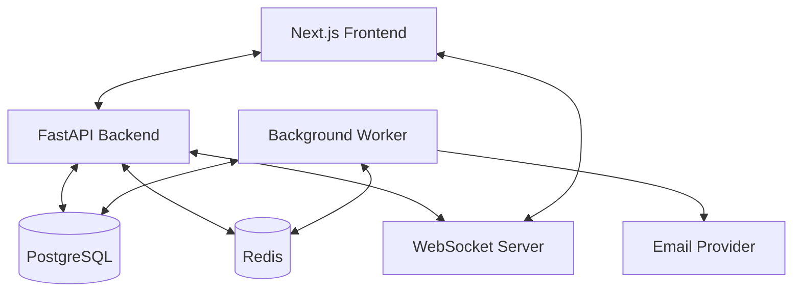
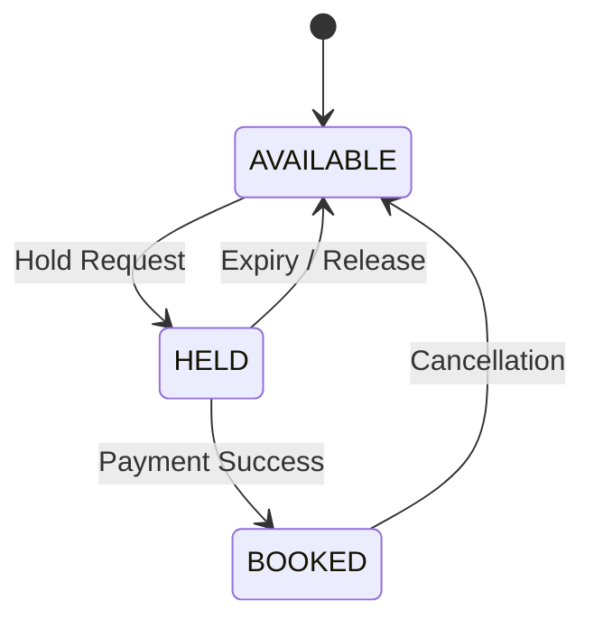
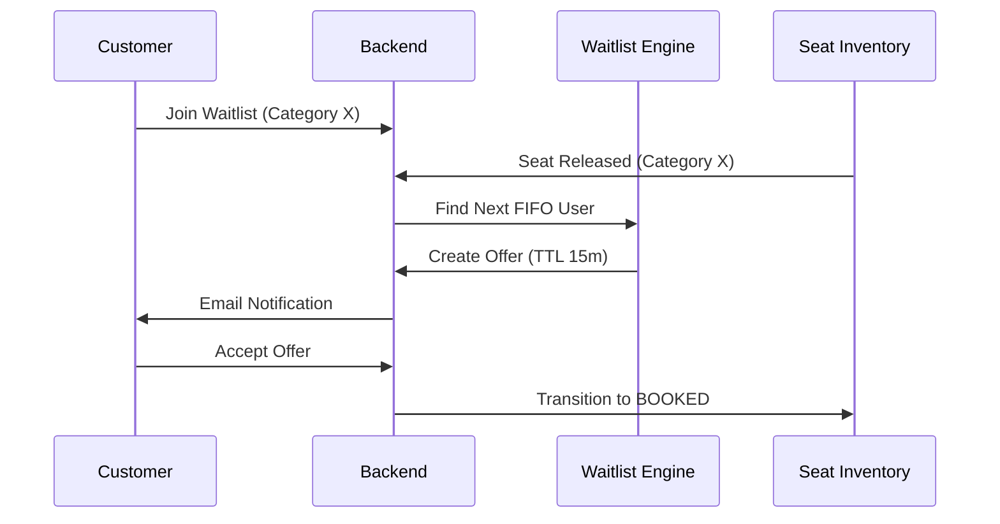

# PHASE 0 — TECHNICAL ARCHITECTURE: Ticket Booking System

This document serves as the authoritative technical architecture for the Ticket Booking System. It defines the requirements, system design, data models, and implementation strategies for all subsequent phases.

---

## A. Requirements Summary

### Customer Requirements
* **Browse & Filter:** Search for events (movies/concerts) by category, date, and location.
* **Visual Seat Map:** View real-time seat availability (Available, Held, Booked) for a specific show.
* **Seat Holding:** Temporarily hold one or more seats for a configurable TTL (e.g., 10 minutes) before completing payment.
* **Booking:** Purchase held seats to receive a confirmed booking.
* **Tickets:** Access QR-code based tickets for confirmed bookings.
* **Email Notifications:** Receive booking confirmations and QR tickets via email.
* **Cancellations:** Cancel a booking (subject to business rules) to release seats.
* **Waitlist:** Join a FIFO-based waitlist for sold-out seat categories.
* **Waitlist Offers:** Receive time-limited offers when inventory becomes available and accept/decline within the window.

### Organiser Requirements
* **Event Management:** Create and manage events, including venue selection and seat category pricing.
* **Dashboards:** View booking summaries and revenue analytics for managed events.

### Admin Requirements
* **Venue Management:** Define venues, including physical seat layouts and categories.
* **System Oversight:** Manage users and global system configurations.

### System Requirements
* **Auto-Release:** Automatically release expired seat holds and expired waitlist offers.
* **Waitlist Automation:** Automatically assign released seats to the next eligible waitlisted customer.
* **Concurrency Control:** Prevent race conditions where multiple users attempt to hold/book the same seat simultaneously.
* **Real-time Updates:** Push seat status changes to connected clients via WebSockets.

### Non-functional/Correctness Requirements
* **Authoritative Source:** PostgreSQL is the single source of truth for all inventory and booking states.
* **Transactional Integrity:** All state transitions (Hold, Book, Cancel, Waitlist Offer) must be atomic and consistent.
* **Security:** Role-Based Access Control (RBAC) must be strictly enforced.

---

## B. Actors and RBAC

### 1. CUSTOMER
* **What they can do:** Browse events, view seat map, hold seats, book seats, view own bookings/tickets, cancel own bookings, join waitlists, accept/decline waitlist offers.
* **What they cannot do:** Create events, manage venues, view other users' bookings, access admin dashboards, manage other users.
* **Major API Access:** `/auth`, `/events` (read), `/inventory` (read), `/holds` (own), `/bookings` (own), `/waitlist` (own).

### 2. ORGANISER
* **What they can do:** Create events, edit own events, view revenue/booking reports for managed events.
* **What they cannot do:** Manage venues (Admin task), manage other organisers' events, access system-wide settings, manage users.
* **Major API Access:** `/auth`, `/events` (manage own), `/organiser/*`, `/reports` (managed events).

### 3. ADMIN
* **What they can do:** Create/Manage venues, manage physical seat layouts, manage all users, view system-wide reports, configure global settings.
* **What they cannot do:** (No functional restrictions, but should operate within audit trails).
* **Major API Access:** All areas including `/admin/*`, `/venues`, `/users`, `/reports` (global).

---

## C. High-Level System Architecture



### Component Responsibilities
* **Next.js Frontend:** Responsible for UI/UX, visual seat map rendering, and client-side countdowns. *Not authoritative for state.*
* **FastAPI Backend:** Orchestrates business logic, enforces RBAC, and manages transactions.
* **PostgreSQL:** The authoritative source of truth for seat inventory, bookings, and waitlists.
* **Redis:** Acts as the message broker for background tasks and the pub/sub engine for WebSockets.
* **Background Worker:** Handles out-of-band tasks: hold/offer expiry checks, email delivery, and QR generation.
* **WebSockets:** Provides real-time notifications for seat status updates to improve UX.

---

## D. Core Domain Model

* **User:** System users (Customer, Organiser, Admin) with authentication credentials.
* **Role:** Defines permissions for RBAC.
* **Venue:** A physical location where events are held (e.g., Cinema Hall A).
* **Seat:** A physical seat within a Venue (e.g., Row A, Seat 1).
* **Seat Category:** Definitions like "VIP", "Premium", "Standard" with base pricing/attributes.
* **Event/Show:** A specific occurrence of a movie/concert at a Venue at a specific time.
* **ShowSeat (Inventory):** The state of a specific `Seat` for a specific `Event`. *This is the core inventory unit.*
* **Booking:** Represents a confirmed transaction for one or more seats.
* **BookingSeat:** Junction table linking `Booking` and `ShowSeat`.
* **WaitlistEntry:** A customer's request for a specific `SeatCategory` in an `Event`.
* **WaitlistOffer:** A time-limited opportunity for a waitlisted user to book a released `ShowSeat`.

---

## 4. IMPORTANT DOMAIN DECISION — PHYSICAL SEATS VS EVENT INVENTORY

A **Seat** is a physical entity belonging to a **Venue**.
A **ShowSeat** represents the inventory for a specific **Event**.

**Reasoning:**
Physical layouts are static, but their availability is ephemeral. Event A and Event B might happen in the same Venue at different times. If Seat A1 is booked for Event A, it must still be available for Event B. Therefore, we instantiate a `ShowSeat` record for every physical seat when an Event is created.

---

## 5. SEAT STATE MACHINE

### ShowSeat States
* **AVAILABLE:** Initial state. Ready to be held.
* **HELD:** Temporarily reserved by a customer.
* **BOOKED:** Permanently reserved for a confirmed booking.

### Transitions
1. `AVAILABLE → HELD`: Customer initiates a hold.
2. `HELD → BOOKED`: Customer completes payment/checkout.
3. `HELD → AVAILABLE`: TTL expires or customer manual release.
4. `BOOKED → AVAILABLE`: Booking is cancelled.

*Note: In waitlist scenarios, the transition from `BOOKED → AVAILABLE` or `HELD → AVAILABLE` might immediately trigger a `WaitlistOffer` flow, effectively moving the seat to a "Reserved for Waitlist" logical state.*

---

## 6. SEAT HOLD + TTL ARCHITECTURE

* **Hold Creation:** Triggered by a POST request to `/holds`. Creates a temporary record or updates `ShowSeat` with a `hold_expires_at` timestamp.
* **Identification:** Identified by `(user_id, show_seat_id)`.
* **Expiration Representation:** A `DATETIME` field in the database.
* **Auto-Release:** A background worker polls for `ShowSeat` records where `status == HELD` and `hold_expires_at < NOW()`.
* **Authority:** The backend database check is final. Even if the frontend timer shows 1 second remaining, if the DB says it's expired, the booking will fail.
* **Conflict Resolution:** If a booking request arrives exactly at expiration, the database transaction determines the winner.

---

## 7. CONCURRENCY ARCHITECTURE

To prevent double-holding/booking, we will use **Database-level Pessimistic Locking**.

**Proposed Strategy:**
Use `SELECT ... FOR UPDATE` within a transaction to lock the specific `ShowSeat` row during the hold/booking attempt.

```sql
BEGIN;
SELECT status FROM show_seats WHERE id = :id FOR UPDATE;
-- Check if AVAILABLE
UPDATE show_seats SET status = 'HELD', held_by = :user_id, expires_at = :now + TTL WHERE id = :id;
COMMIT;
```
This ensures that only one transaction can modify the seat at a time, preventing race conditions without relying on in-memory application locks.

---

## 8. WAITLIST ARCHITECTURE

* **Scope:** Waitlists are scoped to an `(Event, SeatCategory)` pair.
* **Ordering:** Strict FIFO based on `created_at` timestamp.
* **Deduplication:** A user can only have one active waitlist entry per category/event.
* **Offer Lifecycle:**
    1. Seat becomes available (cancellation/expiry).
    2. System identifies the first user in the FIFO queue for that category.
    3. A `WaitlistOffer` record is created with a TTL.
    4. Notification sent to the user.
    5. On Accept: `Offer → Booking`.
    6. On Expire/Decline: System moves to the next user in queue.
* **Concurrency:** The process of picking the next user and creating an offer must be atomic.

---

## 9. BOOKING + CANCELLATION ARCHITECTURE

1. **Hold Phase:** Secure the seat.
2. **Payment Phase:** (Simulated/External) - Verify payment.
3. **Commit Phase:** Transition `ShowSeat` to `BOOKED`, create `Booking` record.
4. **Fulfillment:** Trigger QR generation and Email background tasks.

**Cancellation:**
1. Transactionally update `Booking` to `CANCELLED`.
2. Update `ShowSeat` to `AVAILABLE`.
3. Emit internal event to trigger Waitlist Engine.

---

## 10. REAL-TIME ARCHITECTURE

* **Trigger:** Every `ShowSeat` status change (AVAILABLE/HELD/BOOKED).
* **Publisher:** FastAPI background task publishes a message to Redis Pub/Sub.
* **Subscriber:** WebSocket handlers subscribe to channels named by `event_id` (e.g., `event_updates_{id}`).
* **Payload:** Minimal JSON containing `seat_id` and `new_status`.
* **Resilience:** If disconnected, the client performs a full refresh of the seat map upon reconnection. WebSockets are supplementary; the database remains the authority.

---

## 11. API DOMAIN DESIGN

| Domain | Responsibility | Major Operations | Role Access |
| :--- | :--- | :--- | :--- |
| **Authentication** | Identity management | Login, Register, Token Refresh | Public |
| **Events** | Event discovery | List Events, Filter, Get Details | Public / Customer |
| **Venues** | Venue structure | Create Venue, Define Layout | Admin |
| **Inventory** | Seat state | Get Seat Map for Event | Public / Customer |
| **Holds** | Temporary reservation | Create Hold, Release Hold | Customer |
| **Bookings** | Finalized sales | Checkout, View Tickets, Cancel | Customer / Organiser (View) |
| **Waitlist** | Queue management | Join Waitlist, Accept Offer | Customer |
| **Organiser** | Sales reporting | Revenue Summaries, Managed Events | Organiser |
| **Admin** | System management | User management, Global Config | Admin |

---

## 12. SECURITY ARCHITECTURE

* **Password Hashing:** Argon2.
* **JWT:** Signed tokens for stateless session management.
* **RBAC Middleware:** FastAPI dependency injection to check `user.role` before executing route logic.
* **Ownership Checks:** Ensure customers can only view/cancel their own bookings.
* **Input Validation:** Strict Pydantic models for all request bodies.
* **Secrets:** Environment variables for sensitive data.

---

## 13. TRANSACTIONAL CORRECTNESS

The following must be wrapped in ACID transactions:
* **Holding a Seat:** Select-for-update check + Update status.
* **Booking a Seat:** Verify hold + Create Booking + Create BookingSeat + Update ShowSeat.
* **Cancellation:** Update Booking + Update ShowSeat + Trigger Waitlist Check.
* **Waitlist Offer Creation:** Atomic selection of user + Creation of WaitlistOffer.
* **Waitlist Offer Acceptance:** Verify offer + Create Booking + Update ShowSeat.

---

## 14. FAILURE SCENARIOS

* **Two users attempting the same seat:** Solved by DB row-level locking.
* **Hold expires during checkout:** Backend re-validates `expires_at` before final commit.
* **Waitlist offer expires:** Background worker detects expiry and moves to the next user in FIFO.
* **Email delivery fails:** Worker retries via Redis-backed task queue with at-least-once delivery semantics.
* **Redis enqueuing fails:** If Redis is down when enqueuing a notification AFTER a business transaction commits, the transaction remains committed (booking/offer is valid). The failure is logged, but the business flow is not interrupted.
* **WebSocket disconnect:** Client UI falls back to polling or full refresh on reconnect.

---

## 15. FULFILLMENT SEMANTICS (PHASE 12)

* **Asynchronous Fulfillment:** QR generation and email delivery are decoupled from business transactions.
* **At-Least-Once Delivery:** Due to the nature of the task queue (ARQ), jobs may be executed more than once in case of worker crashes or network issues. The system does NOT guarantee exactly-once email delivery.
* **Reliability:** Failed fulfillment jobs are automatically retried with a configurable delay.
* **Independence:** Business transactions MUST NOT depend on the success of the fulfillment system (Email/QR).

---

## 16. PROJECT STRUCTURE

```text
/
├── frontend/             # Next.js Application
├── backend/
│   ├── app/
│   │   ├── api/          # Routers/Endpoints
│   │   ├── core/         # Config, Security
│   │   ├── models/       # SQLAlchemy Entities
│   │   ├── schemas/      # Pydantic Models
│   │   ├── services/     # Business Logic
│   │   ├── tasks/        # Background Jobs (Redis + Worker)
│   │   └── ws/           # WebSocket Logic
│   ├── migrations/       # Alembic
│   └── tests/
├── docs/                 # Phase Documentation
└── docker-compose.yml
```

---

## 17. IMPLEMENTATION PHASE DEPENDENCIES

1. **Phases 1-3:** Foundation (Database, Models, Auth).
2. **Phases 4-6:** Static Data (Venues, Layouts, Events).
3. **Phases 7-9:** Core Engine (Holds, Concurrency, Bookings).
4. **Phases 10-11:** Waitlist logic (Depends on booking release flows).
5. **Phases 12+:** Real-time, QR, Emails, and Dashboards.

---

## 18. ARCHITECTURAL DECISIONS

* **PostgreSQL:** Chosen for row-level locking and ACID compliance.
* **Redis + Worker:** Chosen for reliable TTL management and background processing.
* **WebSockets:** Supplementary for UX; database is the authority.
* **FastAPI:** Chosen for async support and type safety.
* **Physical Seats vs Show Inventory:** Separated to allow the same seat to be managed across multiple shows independently.

---

## 18. OPEN QUESTIONS / UNDECIDED ITEMS

* **Exact email provider:** To be decided in Phase 12.
* **UI Styling:** Tailwind CSS is the likely candidate but to be confirmed.

---

## 19. ARCHITECTURE DIAGRAMS

### Seat Lifecycle


### Waitlist Flow


---

## 20. PHASE 0 BOUNDARY

**PHASE 0 DOES NOT IMPLEMENT:**
* Database schema or migrations.
* Authentication/JWT logic.
* Real seat booking or TTL workers.
* Frontend code or UI.

---
**END OF PHASE 0**
